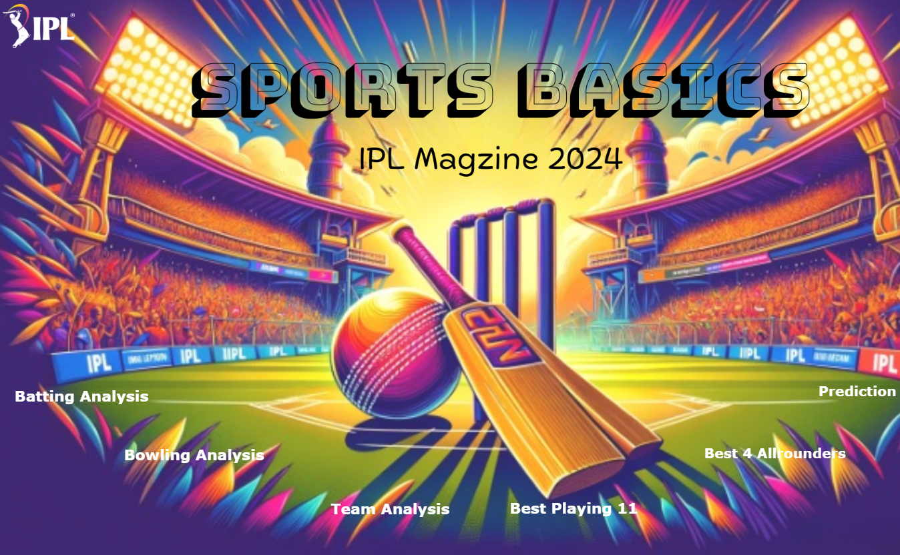

# IPL Performance & Prediction Analytics Dashboard

**Multi-page Power BI dashboard** analyzing three IPL seasons to deliver batting, bowling, team, and all-rounder insights along with a prediction module that highlights likely playoff teams, finalists, and the probable winner.

---

## Table of Contents
- [Features](#features)
- [Data](#data)
- [Pages & Visuals](#pages--visuals)
- [Prediction Module](#prediction-module)
- [Files in this repo](#files-in-this-repo)
- [Batting Analysis](#Batting-Analysis)
- [Bowling Analysis](#Bowling-Analysis)
- [Best 4 all rounder](#Best-4-all-rounder)
- [Best playing 11](#Best-playing-11)
- [Team Analysis](#Team-Analysis)
- [Prediction for 2024](#Prediction-for-2024)
---

## Features
- Batting analytics: top run scorers, strike rates, boundary % and match contributions  
- Bowling analytics: wickets, economy rates, strike rates, phase-based performance  
- Team performance: wins, win % trends, head-to-head comparisons  
- All-rounder comparison: combined batting + bowling impact metrics  
- Interactive filters for season, team, player, and match phase  
- Prediction module using historical metrics to suggest playoff teams, finalists, and winner probabilities

---

### Batting Analysis

---
## Bowling Analysis

---
## Best 4 all rounder
> Replace `screenshots/ipl_dashboard.png` with your exported Power BI screenshot(s).

---
## Best playing 11
> Replace `screenshots/ipl_dashboard.png` with your exported Power BI screenshot(s).

---
## Team Analysis
> Replace `screenshots/ipl_dashboard.png` with your exported Power BI screenshot(s).

---
## Prediction for 2024
> Replace `screenshots/ipl_dashboard.png` with your exported Power BI screenshot(s).

---

## Data
- Source: Three seasons of IPL match & player data (CSV / Excel).  
- Preprocessing: cleaned and aggregated using Power Query (within Power BI).  
- Key tables: `Matches`, `Innings`, `Players`, `Teams`, `Aggregates`.

---

## Pages & Visuals
1. **Home / Overview** — Season selectors, KPI cards, trend charts.  
2. **Batting** — Runs, strike rate, boundaries, player contribution charts.  
3. **Bowling** — Wickets, economy, phase-wise breakdown.  
4. **Team Analysis** — Win rates, head-to-head, comparative radar charts.  
5. **All-Rounders** — Scatter / quadrant analysis of batting vs bowling impact.  
6. **Prediction** — Playoff & winner probability visualizations and reasoning.

---

## Prediction Module
- Uses aggregated historical KPIs (team form, net run rate proxies, top player contributions)  
- Produces ranked probabilities for: Playoff teams, Finalists, Tournament winner  
- Visualized as probability bars / rank cards for end-user interpretation

---

## Files in this repo
